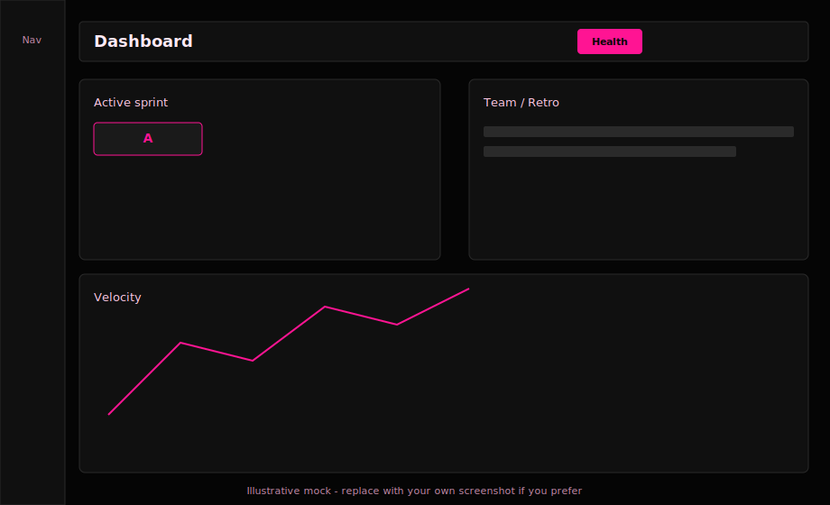
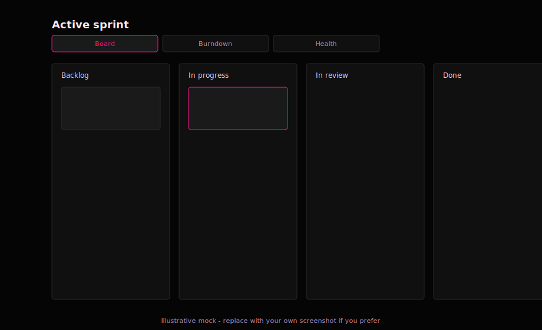
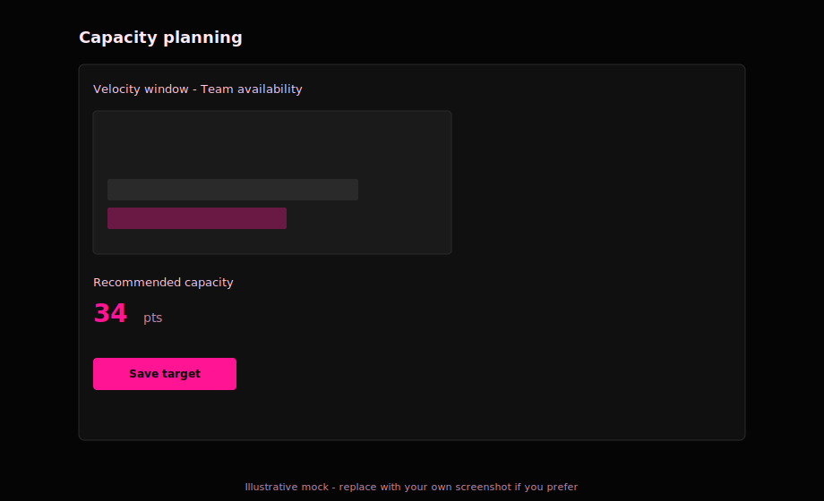
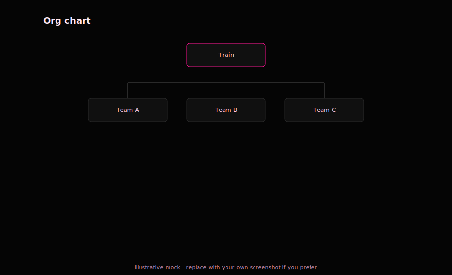

# The Ruck

*Developed by Sydney Edwards.*

Like the rugby ruck it's named after — the contested moment where a team fights for control — The Ruck keeps your sprints, capacity, and retrospectives organized when things get chaotic.

**The Ruck** is a portfolio-quality, scrum-native web app: **React (Vite)** + **Express** + **JSON file persistence** (repository pattern, swappable for Postgres later). No auth in v1 — built for a single team running locally.

**Training:** See **[docs/TRAINING_AGILE_AT_SCALE.md](docs/TRAINING_AGILE_AT_SCALE.md)** for how to use the app to run **Agile at scale** (teams, cadence, capacity, ceremonies, governance habits).

**Project docs**

| Doc | Contents |
|-----|----------|
| **[docs/TESTING.md](docs/TESTING.md)** | How tests are organized (shared / server / client), runners, and conventions |
| **[docs/STYLE_GUIDE.md](docs/STYLE_GUIDE.md)** | TypeScript, React, Express, and shared-package guidelines |
| **[docs/TRAINING_AGILE_AT_SCALE.md](docs/TRAINING_AGILE_AT_SCALE.md)** | Agile-at-scale usage |
| **[docs/screenshots/README.md](docs/screenshots/README.md)** | Replacing illustrative screenshots with real captures |
| **[CREDITS.md](CREDITS.md)** | Credits |

---

## Quick start

### Prerequisites
- **Node.js** 18+ (LTS recommended) and **npm**

### Install & run
From the **repository root**:

```bash
npm install
```

(Optional) Load demo data — clears existing JSON data and seeds teams, sprints, stories, retros, activity log, etc.:

```bash
npm run seed
```

Start **client + API** together:

```bash
npm run dev
```

Then:

| What | URL |
|------|-----|
| **Web app (use this for the UI)** | `http://localhost:5173` — **use the URL printed by Vite** if it says the port is in use (e.g. `5174`) |
| **REST API** | `http://localhost:3001` |
| **API health** | `http://localhost:3001/api/health` |
| **Swagger UI** | `http://localhost:3001/api/docs` |

**Important**
- Open the **Vite** URL for the React UI. **`http://localhost:3001` is the API only** (JSON + docs). Opening the API root in a browser shows a small HTML hint page, not the app.
- Ensure **both** processes from `npm run dev` are running (client + server). If the API is down, pages that fetch data will show errors or empty states.

### Other useful commands

| Command | Purpose |
|---------|---------|
| `npm run build` | Production build: `shared` → `server` → `client` |
| `npm run typecheck` | Typecheck all workspaces |
| `npm test` | Run all workspace test suites (**client** Vitest, **server** integration, **shared** unit tests) |
| `npm run seed` | Reseed `server/data/*.json` (same as `npm -w server run seed`) |
| `npm -w client run dev` | Client only |
| `npm -w server run dev` | API only |

---

## Features

### Dashboard (`/dashboard`)
- Landing page: active sprint snapshot, **Sprint Health** grade badge (hover the **ⓘ** for how the score works), multi-layer progress vs capacity, velocity sparkline (last completed sprints), team summary, retro summary, overdue action items, recent activity timeline
- Auto-refresh when tab visible; manual refresh; “Getting Started” checklist when data is empty
- Route title: `Dashboard · The Ruck`

### Backlog (`/backlog`)
- Sprint filter chips; flat story list; create/edit via **Story Detail Drawer**
- Markdown description with preview; Fibonacci **or** T-shirt sizing (from settings); assignee, labels, column, acceptance criteria, sprint assignment; auto-save
- **Start Planning Poker** when a sprint is **active** (same modal as active sprint)

### Active sprint (`/sprint/active`)
- **Board | Burndown | Health** tabs: Kanban default; **Burndown** shows ideal vs actual remaining work, projection, capacity target, and status (Recharts); **Health** shows the **Sprint Health Score** (gauge, breakdown, trend, sparkline from last completed sprints)
- Kanban (Backlog → In Progress → In Review → Done) with **@dnd-kit** drag-and-drop, optimistic updates, rollback on failure
- Sprint header: goal, dates, days remaining, burndown-style progress, **Start Planning Poker** (with active sprint), complete sprint (with confirm)

### Planning Poker (`/poker/:sessionId`)

Real-time **collaborative estimation**: the team picks story points for sprint backlog items together, votes privately, then reveals all cards at once. Sessions are **ephemeral** (in memory only) — they disappear when everyone leaves or the facilitator closes the session. Nothing is written to the JSON data files except the **agreed story points** when the facilitator confirms a value.

#### How to start
1. There must be an **active sprint** (Backlog and Active Sprint pages show **Start Planning Poker** only when one exists).
2. Click **Start Planning Poker** → modal: choose **who you are** (team member; saved in `localStorage` for next time).
3. **Select stories** in the sprint to estimate (defaults to all **unestimated** stories — `storyPoints: null`). Toggle **Include already-estimated stories** to add pointed work; use **Select all unestimated** and **↑ / ↓** to order the queue.
4. **Create session & continue** → copy the share link (`/poker/:sessionId`) for teammates → **Open poker room** (or share the URL). Others open the link, pick themselves if needed, and join the same session over the WebSocket.

#### In the room
- **Full-screen** UI (no sidebar): sprint name, connected participants (presence dot on avatars), **👑** on the current facilitator’s avatar.
- **Voting:** everyone taps a **Fibonacci** card: `0, 1, 2, 3, 5, 8, 13, 21`, or **`?`** / **`∞`**. Until reveal, others only see that you’ve voted (✓ / ⏳), **not** your number.
- **Facilitator** (creator’s `memberId` on `POST /api/poker/sessions`, or the **first remaining participant** in join order if the facilitator disconnects): **Reveal votes** → cards flip; summary shows distribution, numeric average, and consensus hint (consensus / near / wide spread). Then choose **agreed points** (defaults to the **median** of numeric votes), **Save & next story** (writes `storyPoints` via the stories API and moves on), **Re-vote** (clear votes, same story), or **Skip story** (no save, next in queue).
- When the queue is empty, **Estimation complete** shows a summary table; **Close session** ends the room and returns to the sprint board.

#### Technical notes
| Topic | Detail |
|--------|--------|
| **Transport** | **Socket.io** is attached to the **same HTTP server** as Express (`server/src/index.ts`) — not a separate port. Client uses the API origin with `/api` stripped (see `client/src/lib/socketUrl.ts`). CORS defaults to `http://localhost:5173`; override with **`CLIENT_ORIGIN`** if needed. |
| **State** | In-memory `Map` in `server/src/poker/sessionStore.ts`. Handlers: `server/src/sockets/pokerSocket.ts`. |
| **REST** | `POST /api/poker/sessions` — `{ sprintId, storyQueue, memberId, memberName, avatarColor }` → `{ sessionId }`. `GET /api/poker/sessions/:id?memberId=` — current snapshot (votes masked until reveal); used after refresh before the socket reconnects. |
| **Persistence** | Only **story points** on each story when facilitator confirms; session history is not stored on disk. |
| **Reconnection** | Same `memberId` + `session:join` restores your vote and seat; if the session is gone, the UI shows session ended / not found. |

**Tests:** `server/tests/pokerSocket.test.ts` (Socket.io client against an in-process HTTP server).

### Sprint Health Score
A **read-only** 0–100 score (letter grade **A–F**) summarizing how the sprint is going. It is **computed on demand** from existing data (not stored for the active sprint). The **Dashboard** shows a compact grade badge next to the active sprint name; the **Health** tab shows the full breakdown and a sparkline of scores from **completed** sprints (each completion stores a **final** snapshot on the sprint for history).

**Design:** The score is **transparent** — every component is shown with points and a plain-language explanation. Implementation lives in **`shared/src/healthScore.ts`**; API: **`GET /api/sprints/:id/health`**.

**Total:** Sum of **five** components, **20 points** each (max **100**).

| Component | What it measures | Scoring (summary) |
|-----------|------------------|---------------------|
| **Velocity adherence** | Pace of done work vs ideal burn from the burndown | **Actual burn rate** = completed story points ÷ (working days elapsed from sprint start through today or end). **Ideal burn rate** = (capacity target, or total points if no target) ÷ total sprint working days. **Ratio** = actual ÷ ideal. Points: ≥0.95 → 20; ≥0.80 → 15; ≥0.65 → 10; ≥0.50 → 5; &lt;0.50 → 0. If **no** working days elapsed yet → **10** (neutral). |
| **Scope stability** | Stories added after sprint start | Uses **`sprintAddedAt`** on each story (set when the story is assigned to the **active** sprint). **Scope creep ratio** = (stories with `sprintAddedAt` date **after** sprint start) ÷ (original story count). Points: 0 creep → 20; ≤10% → 16; ≤20% → 12; ≤30% → 6; &gt;30% → 0. |
| **Capacity alignment** | Planned work vs capacity target | **Over/under** = total story points in sprint ÷ capacity target. If **no** capacity target → **10** (neutral). Points: 0.90–1.10 → 20; 0.80–1.20 → 14; 0.70–1.30 → 8; otherwise → 0. |
| **Team availability** | Team capacity signal | Uses **`teamAvailabilityRatio`** from the planning **capacity snapshot** when present; otherwise **live** ratio from current team members. If **no** usable ratio → **10** (neutral). Points: ≥0.95 → 20; ≥0.85 → 16; ≥0.70 → 10; ≥0.55 → 5; &lt;0.55 → 0. |
| **Retro health** | Reflection and follow-through | **+5** if a retro exists for this sprint; **+5** if the retro has **≥3** cards; **+5** if **≥1** action item; **+5** from **closure** of action items from the **last two** prior retros (≥50% closed → full 5; &gt;0% → 2; 0% → 0). |

**Grade:** 90–100 → A; 80–89 → B; 70–79 → C; 60–69 → D; &lt;60 → F.

**Trend:** Compares to the **previous completed sprint’s** stored health total (if any): ↑ / → / ↓, or “insufficient data” when there is no prior score.

**Completion:** **`POST /api/sprints/:id/complete`** saves **`finalHealthScore`** `{ total, grade, components }` on the sprint for history and sparklines.

### Sprint history (`/sprints`)
- All sprints, reverse chronological; status, velocity; create sprint; set active (one active sprint rule); **Capacity Planning** slide-over for planning sprints
- **Completed** sprints: expandable **View burndown** with a compact chart and final velocity

### Capacity planning
- Velocity window (1 / 2 / 3 / 5 sprints), team availability (days off, subteam grouping), Fibonacci snap, manual override, save **capacity target** + snapshot on sprint
- Defaults (e.g. velocity window) follow **Settings**

### Team (`/team`, `/team/org-chart`)
- Members: roles, capacity multipliers, activate/deactivate, **Teams** tab with hierarchy, memberships, **Org chart** (`/team/org-chart`) with layout from d3-hierarchy + HTML/CSS nodes

### Retros (`/retros`, `/retro/:id`)
- List with past/active/closed; **Create retro** modal (sprint, template, title, anonymous default from settings)
- Board: **Reflect → Discuss → Action items → Closed**; templates (Start/Stop/Continue, 4Ls, Mad/Sad/Glad); cards, upvotes, grouping; action items; carried-over items; close retro with confirmation

### Settings (`/settings`)
- **Sprint defaults:** default sprint length (days), default velocity window, story point scale (Fibonacci vs T-shirt)
- **Retro defaults:** default template, default anonymous mode
- **Display:** theme (synced with sidebar), date format (used app-wide via `formatDate` from settings context)
- **Data:** `GET /api/export` download as JSON; **Reset all data** (double confirm + type `RESET`) → `DELETE /api/reset` clears files and re-seeds

### App shell & UX
- Persistent sidebar (collapsible, persisted state); dark/light theme (CSS variables, hot pink accents)
- Shared UI: `PageHeader`, `Card`, `Badge`, `Avatar`, `EmptyState`, `ConfirmDialog`, `Spinner`, toasts
- **SettingsContext:** loads settings once; `useSettings()` / `updateSetting`; shared `formatDate()`
- **404** route with link home; **document titles** per route; **error boundary** for runtime errors
- Client resolves `@the-ruck/shared` via **Vite alias** to `shared/src` (see `client/vite.config.ts`) so the UI works without building `shared/dist` first

### Backend & data
- **JSON repositories** under `server/data/` (override with `THE_RUCK_DATA_DIR`)
- **Burndown snapshots** — daily **`SprintDaySnapshot`** rows per sprint (remaining/completed points, column counts); **upsert** per calendar day. Recorded on: **cron** (23:59 local), story moves to/from **done**, sprint **complete**, sprint **active** (day‑0 snapshot). See **`GET /api/sprints/:id/burndown`** for ideal line, snapshots, and projection.
- **Sprint Health Score** — **`shared/src/healthScore.ts`**; **`GET /api/sprints/:id/health`** returns fresh calculation + history; **`GET /api/dashboard`** includes `activeSprint.healthScore` `{ total, grade, trend }`; **sprint completion** persists **`finalHealthScore`** for sparklines.
- **Activity log** for dashboard feed (story moves, sprint completed, retro cards, action items, etc.)
- **Velocity engine** (`shared/src/velocityEngine.ts`) — shared TypeScript module (no Node `module.exports` in the browser bundle)
- **Burndown math** (`shared/src/burndownUtils.ts`) — ideal line (working days), projected completion; used by the API and UI
- **OpenAPI** + Swagger UI (`/api/docs`) and `server/API.md`
- On server start, the burndown scheduler logs: **`Burndown snapshot scheduler registered`**

---

## API overview (all responses `{ data, error, meta }`)

Core resources:
- `GET/POST /api/team-members`, `GET/PATCH/DELETE /api/team-members/:id`
- `GET/POST /api/teams`, tree, members, hierarchy (see `server/src/routes/teamsRoutes.ts`)
- `GET/POST /api/sprints`, `GET/PATCH/DELETE /api/sprints/:id`, `POST /api/sprints/:id/complete`, `GET /api/sprints/:id/capacity-context`, `GET /api/sprints/:id/burndown` (snapshots, ideal burndown, projection), `GET /api/sprints/:id/health` (Sprint Health Score + breakdown + history)
- `POST/GET /api/poker/sessions` — planning poker (WebSockets on same server)
- `GET/POST /api/stories`, `GET/PATCH/DELETE /api/stories/:id` — `?sprintId=backlog` or sprint id
- `GET/POST /api/retros`, nested cards & action items under `/api/retros/:id/...`
- `GET/PUT /api/settings` — extended settings (sprint length, velocity window, story scale, retro defaults, date format)
- `GET /api/dashboard` — aggregated dashboard payload (includes **`activeSprint.healthScore`** when an active sprint exists)
- `GET /api/export` — full JSON export
- `DELETE /api/reset` — clear data files and re-run seed

Details: **`server/API.md`** and **`http://localhost:3001/api/docs`** (when running).

---

## Testing

See **[docs/TESTING.md](docs/TESTING.md)** for full detail: where tests live, **Node test runner** vs **Vitest**, **server `DATA_DIR`** isolation, and adding new test files to **`package.json`** scripts.

- **Run everything:** `npm test` (all workspaces with a `test` script). **Server** tests use `--test-concurrency=1` and an explicit file list so `server/tests/test-data` is not corrupted by parallel runs.
- **Coverage:** `npm run test:coverage`
  - **Client:** `src/lib/**` only — Vitest thresholds warn below **85%** lines/statements (see `client/vitest.config.ts`).
  - **Shared:** Node’s built-in coverage over `velocityEngine`, `buildTeamTree`, retro templates, dashboard helpers, **burndown utils**, etc.
  - **Server:** `--experimental-test-coverage` over the whole server tree; integration tests hit routes, app shell, export/OpenAPI, and burndown. Line % for the full package is lower than routes alone because `seed.ts`, `workingDays`, etc. are mostly unused in tests.

## Architecture

- **Repository pattern:** handlers use repositories only; swap `server/src/repositories/*` implementations to move to Postgres/Prisma without changing business logic.
- **Shared package (`shared/`):** domain types (`shared/src/types`), `velocityEngine`, **`healthScore`**, `buildTeamTree`, API types. Client imports source via Vite alias; server uses TypeScript path mapping to `shared/src`.
- **SettingsContext:** single settings fetch, centralized `formatDate` and `updateSetting` for consistent UX.

---

## Troubleshooting

| Symptom | What to check |
|--------|----------------|
| **Blank white page** | Use the **Vite** URL from the terminal, not port `3001`. Hard refresh (Cmd+Shift+R). Open DevTools → Console for errors. |
| **`module is not defined` (velocity)** | Fixed in current code: engine lives in `shared/src/velocityEngine.ts`. Pull latest and restart `npm run dev`. |
| **API 404 on `/`** | Normal for JSON clients; browser GET `/` on the API returns a small HTML help page. |
| **`shared/dist` / package main** | The client does **not** rely on `shared/dist` for dev — the Vite alias points at `shared/src`. For production builds of the `shared` package alone, run `npm -w shared run build`. |

---

## Screenshots

Illustrative **SVG** mockups (dark theme, pink accents) — versioned in-repo so GitHub renders without large binaries. To swap in **real** PNG/WebP captures from your machine, see **[docs/screenshots/README.md](docs/screenshots/README.md)**.

### Dashboard (`/dashboard`)


### Backlog (`/backlog`)


### Active sprint (`/sprint/active`)


### Planning Poker (`/poker/:sessionId`)


### Capacity planning (sprint slide-over)


### Retrospective (`/retro/:id`)


### Team (`/team`)


### Org chart (`/team/org-chart`)


### Settings (`/settings`)


---

## Roadmap (v2 ideas)

- Auth (team-scoped) + user identity  
- Broader realtime updates (beyond Planning Poker)  
- Postgres migration via repository swap (Prisma)  
- Richer retro clustering & voting  
- Capacity UX polish  

---

## Contributing

1. Fork the repo and create a feature branch.  
2. Run `npm install` and `npm run typecheck` before opening a PR.  
3. Run `npm test` (and `npm run test:coverage` when changing testable library code).  
4. Follow **[docs/STYLE_GUIDE.md](docs/STYLE_GUIDE.md)** for conventions; extend **[docs/TESTING.md](docs/TESTING.md)** if you introduce new test patterns.  
5. Keep UI/API changes documented in the PR; update **`README.md`**, **`server/API.md`**, and the OpenAPI spec when endpoints change.

---

*Developed by Sydney Edwards.*
